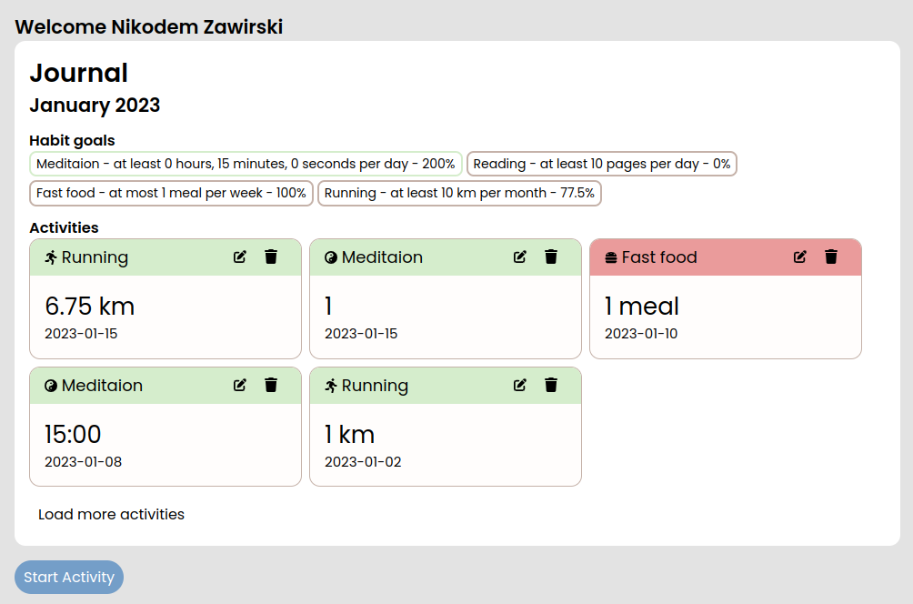
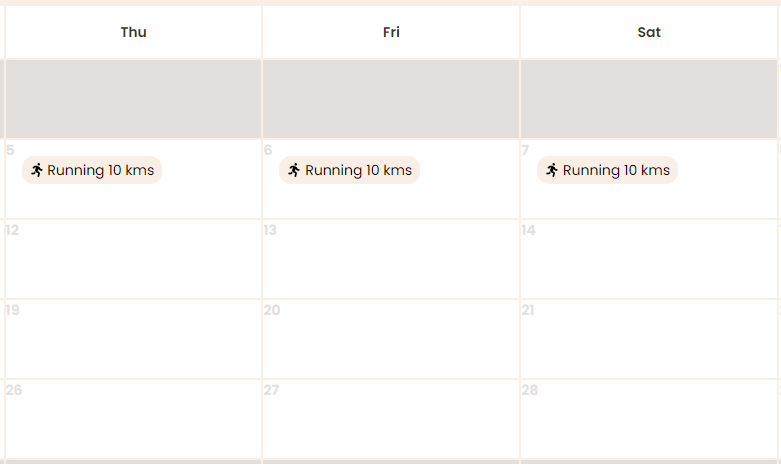

# Habitea

## Activity and Habit tracker

Branch `staging` deploys to [habitea.netlify.app](https://habitea.netlify.app/)  

Deploy status:  

## Screenshots

## Development

`npm install` - install dependencies  
`npm run dev` - run development server  
`npm run build` - build production version  
`npm run start` - run production server  
`npm run lint` - run linter  
`npm run lint:fix` - run linter and fix errors  
`npm run clear` - clear build cache  

## Contributing

WIP
