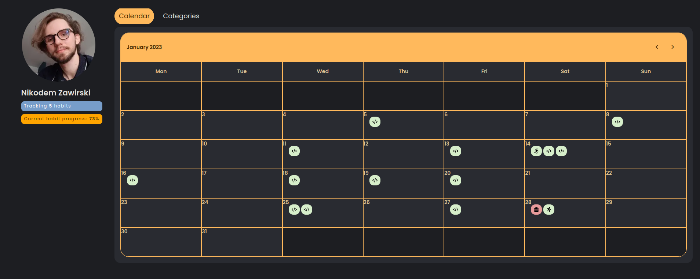
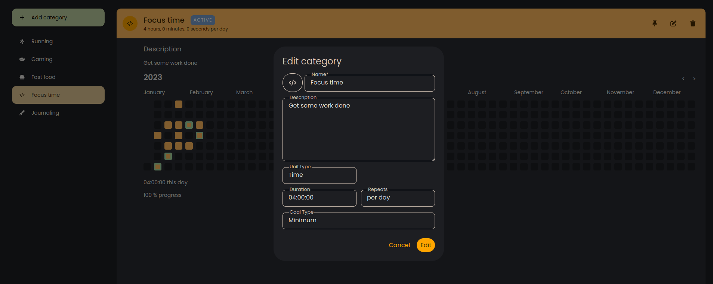

# Habitea

## Activity and Habit tracker

[habitea.netlify.app](https://habitea.netlify.app/)

Habitea is simple and easy-to-use habit tracker that will help you take control of your life and make positive changes that last.

Habitea is built with [Next.js](https://nextjs.org/) and [Firebase](https://firebase.google.com/) and is released under the [GNU Affero General Public License](https://www.gnu.org/licenses/agpl-3.0-standalone.html) license.

Branch `production` is automatically deployed to [Netlify](https://www.netlify.com/) and can be accessed [here](https://habitea.netlify.app/).

Deploy status:  
[](https://app.netlify.com/sites/habitea/deploys)

## Screenshots





## Development

`npm install` - install dependencies  
`npm run dev` - run development server  
`npm run build` - build production version  
`npm run start` - run production server  
`npm run lint` - run linter  
`npm run lint:fix` - run linter and fix errors  
`npm run clear` - clear build cache

### Firestore

`common/services/firebase.ts` contains firebase configuration.  
Firebase API keys **do not** need to be obscured, database is secured by [Firebase Security Rules](https://firebase.google.com/docs/rules). Learn more [here](https://firebase.google.com/docs/projects/api-keys)

If you want to change the database the app is using in your environment, [set up your firebase project](https://firebase.google.com/docs/web/setup) and replace the credentials in `common/service/firebase.ts`. Don't forget to set up rules and indexes for your database. Below is the configuration of cloud firestore rules the app should have in order to work properly.

### Cloud firestore rules

```
rules_version = '2';
service cloud.firestore {
  match /databases/{database}/documents {
    match /activityCategories/{document=**}{
     allow create: if request.auth != null
    }

    match /activityCategories/{document=**} {
     allow read, write: if request.auth != null && request.auth.uid == resource.data.createdBy;
    }

    match /activities/{document=**}{
     allow create: if request.auth != null
    }

    match /activities/{document=**} {
     allow read, write: if request.auth != null && request.auth.uid == resource.data.createdBy;
    }

    match /categoryProgress/{document=**}{
     allow create: if request.auth != null
    }

    match /categoryProgress/{document=**} {
     allow read, write: if request.auth != null && request.auth.uid == resource.data.createdBy;
    }
  }
}
```

### Firebase auth

App uses Email/Password, Github and Google auth providers from Firebase Authentication. Refer to [Firebase documentation](https://firebase.google.com/docs/auth) if you want to set it up in your own firebase project.

## Contributing

Feel free to open issues and pull requests. Please make pull requests to `main` branch.
